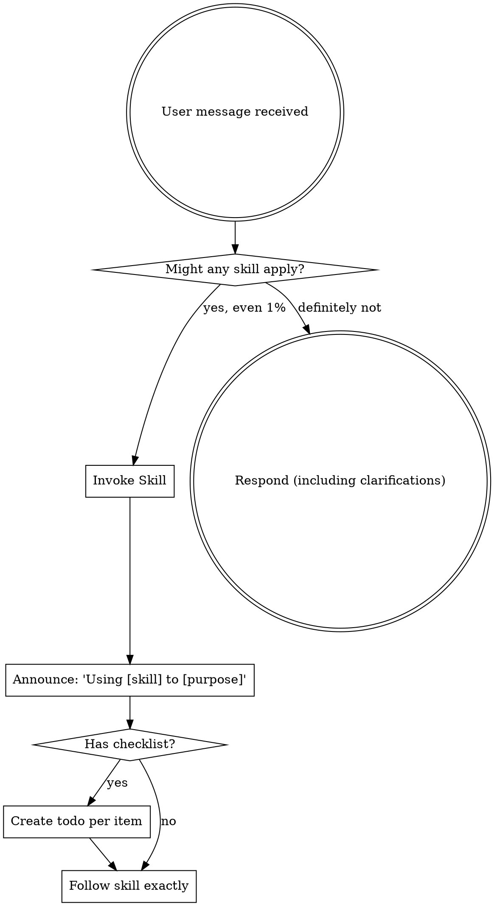

<EXTREMELY-IMPORTANT>
If you think there is even a 1% chance a skill might apply to what you are doing, you ABSOLUTELY MUST invoke the skill.

IF A SKILL APPLIES TO YOUR TASK, YOU DO NOT HAVE A CHOICE. YOU MUST USE IT.

This is not negotiable. This is not optional. You cannot rationalize your way out of this.
</EXTREMELY-IMPORTANT>

## How to Access Skills

Read the relevant SKILL.md file from the `skills/` directory in this project. When you invoke a skill, its content is loaded and presented to you -- follow it directly.

# Using Skills

## The Rule

**Invoke relevant or requested skills BEFORE any response or action.** Even a 1% chance a skill might apply means that you should invoke the skill to check. If an invoked skill turns out to be wrong for the situation, you don't need to use it.

## Mandatory Skill Routing Table

<EXTREMELY-IMPORTANT>
ALL Super-Ralph skills use the `sr-` prefix. You MUST use the EXACT skill names below.
NEVER use unprefixed names like "brainstorming", "test-driven-development", or "systematic-debugging".
NEVER invoke superpowers:* skills — use the sr- prefixed Super-Ralph versions instead.
</EXTREMELY-IMPORTANT>

| Task Type | EXACT Skill to Invoke | When |
|-----------|----------------------|------|
| New feature, creative work | **sr-brainstorming** | BEFORE any design or implementation |
| Create implementation plan | **sr-writing-plans** | After design is approved |
| Any implementation work | **sr-test-driven-development** | ALL coding (features, bugs, refactoring) |
| Bug, test failure, error | **sr-systematic-debugging** | BEFORE proposing any fix |
| Claiming work is done | **sr-verification-before-completion** | BEFORE any commit or completion claim |
| Execute plan (same session) | **sr-subagent-driven-development** | Independent tasks with subagents |
| Execute plan (new session) | **sr-executing-plans** | Batch execution with checkpoints |
| After completing tasks | **sr-requesting-code-review** | Dispatch code-reviewer subagent |
| Received review feedback | **sr-receiving-code-review** | Evaluate feedback critically |
| All tasks done, integrate | **sr-finishing-a-development-branch** | Merge, PR, or cleanup |
| Need isolated workspace | **sr-using-git-worktrees** | Feature isolation |
| 3+ independent failures | **sr-dispatching-parallel-agents** | Parallel agents |
| Creating/editing skills | **sr-writing-skills** | TDD for skills |

**Workflow chains (use EXACT names):**
- "Build a feature" → **sr-brainstorming** → **sr-writing-plans** → **sr-test-driven-development**
- "Fix this bug" → **sr-systematic-debugging** → **sr-test-driven-development**
- "Is this done?" → **sr-verification-before-completion**
- "Review this code" → **sr-requesting-code-review**

## Red Flags

These thoughts mean STOP -- you're rationalizing:

| Thought | Reality |
|---------|---------|
| "This is just a simple question" | Questions are tasks. Check for skills. |
| "I need more context first" | Skill check comes BEFORE clarifying questions. |
| "Let me explore the codebase first" | Skills tell you HOW to explore. Check first. |
| "I can check git/files quickly" | Files lack conversation context. Check for skills. |
| "Let me gather information first" | Skills tell you HOW to gather information. |
| "This doesn't need a formal skill" | If a skill exists, use it. |
| "I remember this skill" | Skills evolve. Read current version. |
| "This doesn't count as a task" | Action = task. Check for skills. |
| "The skill is overkill" | Simple things become complex. Use it. |
| "I'll just do this one thing first" | Check BEFORE doing anything. |
| "This feels productive" | Undisciplined action wastes time. Skills prevent this. |
| "I know what that means" | Knowing the concept != using the skill. Invoke it. |

## Skill Priority

When multiple skills could apply, use this order:

1. **Process skills first** (sr-brainstorming, sr-systematic-debugging) - these determine HOW to approach the task
2. **Implementation skills second** (sr-test-driven-development, sr-writing-plans) - these guide execution

"Let's build X" → sr-brainstorming first, then implementation skills.
"Fix this bug" → sr-systematic-debugging first, then domain-specific skills.

## Skill Types

**Rigid** (sr-test-driven-development, sr-systematic-debugging): Follow exactly. Don't adapt away discipline.

**Flexible** (patterns): Adapt principles to context.

The skill itself tells you which.

## Enforcement Rules

<EXTREMELY-IMPORTANT>
These rules are NON-NEGOTIABLE. Violating them is a critical failure.

1. **ANNOUNCE before using:** Always say "I'm using sr-[skill-name] to [purpose]" before following a skill.
2. **NEVER skip sr-verification-before-completion:** Before ANY claim that work is done, tests pass, or code compiles — you MUST run the actual commands and read the output. Saying "should work" or "looks correct" without evidence is a VIOLATION.
3. **NEVER propose fixes without sr-systematic-debugging:** If something is broken, you MUST complete Phase 1 (root cause investigation) before suggesting any fix.
4. **ONE fix at a time:** Never bundle multiple fixes. Test each fix individually.
5. **NO code formatting degradation:** Never compress multi-line code to single lines. Maintain or improve readability.
6. **Evidence before assertions:** Every success claim requires command output proving it. "Compiles successfully" requires `cargo check` with 0 errors shown.
</EXTREMELY-IMPORTANT>

## User Instructions

Instructions say WHAT, not HOW. "Add X" or "Fix Y" doesn't mean skip workflows.
